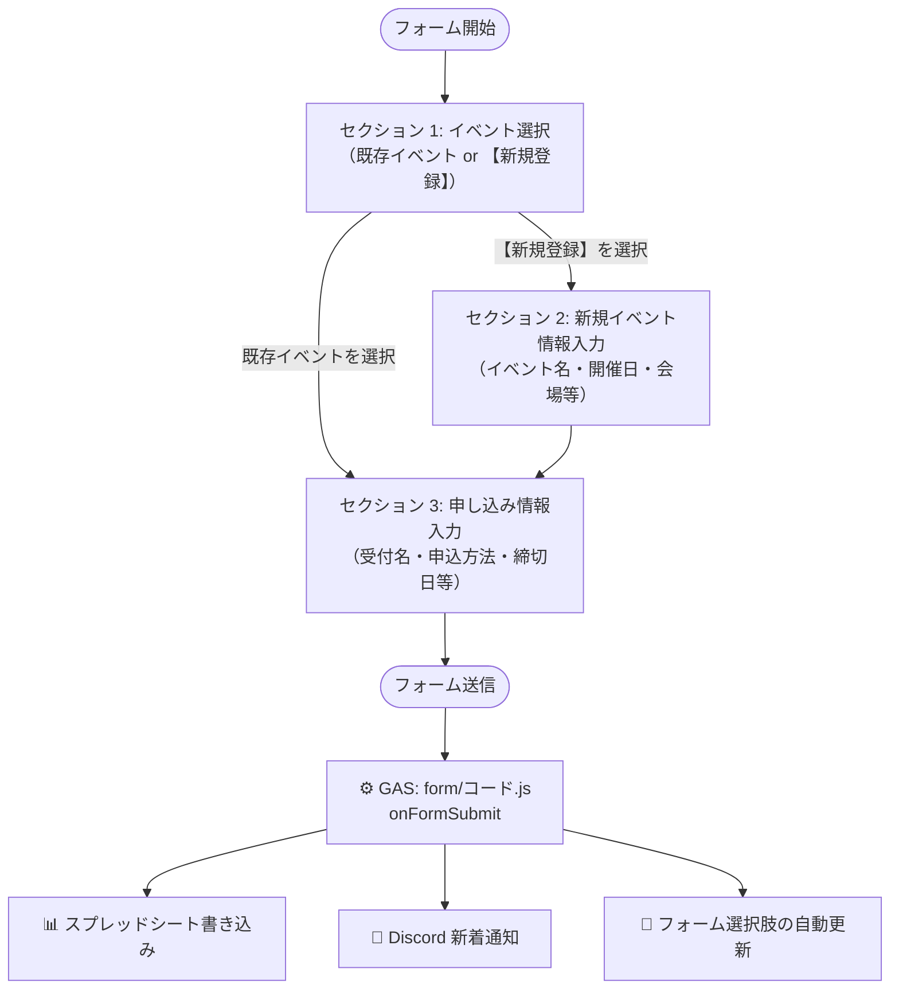

# Google フォーム連携仕様書

本ドキュメントは `discord-notifier` システムにおける Google フォームの構成・設問項目・処理フローに関する仕様書です。

> [!NOTE]
> Webアプリからの登録機能が整備されたことで、新規の入力はWebアプリが推奨ルートです。  
> フォームは既存フローとの互換維持・モバイルからの手軽な入力ルートとして並存しています。

---

## 1. フォーム処理フロー

---

## 2. セクション構成と設問項目

### ■ セクション 1: イベント選択

| 設問タイトル | フォーム要素 | 必須 | 概要・挙動 |
| :--- | :--- | :--- | :--- |
| **イベント名** | ドロップダウン / ラジオボタン | 必須 | スプレッドシートの「イベントマスター」から自動同期された選択肢。 ・既存イベント選択時 ➔ **セクション 3 へ移動** ・`【新規登録】新しいイベントを入力する` 選択時 ➔ **セクション 2 へ移動** |

### ■ セクション 2: 新規イベント情報

> ※「イベント名」で `【新規登録】新しいイベントを入力する` を選択した場合のみ表示

| 設問タイトル | フォーム要素 | 必須 | 概要・データ形式 |
| :--- | :--- | :--- | :--- |
| **新規イベント名（新しいイベントの場合のみ入力）** | 記述式 (ショート) | 必須 | イベントの正式名称 |
| **ブランド** | 記述式 / ドロップダウン | 任意 | 例: `学マス`, `デレ`, `シャニ` 等 |
| **開始日** | 日付 | 必須 | `yyyy-MM-dd` |
| **終了日** | 日付 | 任意 | `yyyy-MM-dd` (無ければ開始日と同日) |
| **会場** | 記述式 (ショート) | 任意 | イベント開催場所 |
| **イベント概要** | 段落 (ロング) | 任意 | メモ・補足説明 |

### ■ セクション 3: 申し込み情報 (共通)

> 既存イベント選択、または新規イベント入力後に進むセクション

| 設問タイトル | フォーム要素 | 必須 | 概要・データ形式 |
| :--- | :--- | :--- | :--- |
| **受付名（先行/一般など）** | 記述式 (ショート) | 必須 | 受付区分 (例: `アソビストア限定先行`, `一般先着`, `公式リセール`) |
| **申込方法** | 記述式 / 段落 | 任意 | チケット申込方法（URLまたは応募手順等の複数行テキスト） |
| **申込開始日** | 日時 | 任意 | `yyyy-MM-dd HH:mm` |
| **申込締切日** | 日時 | 必須 | `yyyy-MM-dd HH:mm` |
| **当落発表日** | 日時 | 任意 | `yyyy-MM-dd HH:mm` |
| **入金締め切り日** | 日時 | 任意 | `yyyy-MM-dd HH:mm` |

---

## 3. フォーム関連のトリガー定義

| 実行スクリプト | 関数名 | トリガー種別 | 実行頻度 / イベント | 処理概要 |
| :--- | :--- | :--- | :--- | :--- |
| **`form/コード.js`** | `onFormSubmit` | **フォーム** | **フォーム送信時** | 1. フォームの回答からイベント/申込行を追記 2. ID自動採番 & IFS数式を挿入 3. フォーム選択肢を更新 4. Discord（`WEBHOOK_APPLY`）に新着申込を通知 |
| **`form/コード.js`** | `updateFormOptions` | 関数呼出 | フォーム送信時 | 終了日が今日以降のイベントを取得し、フォームの選択肢（ドロップダウン）を動的に再構築 |
