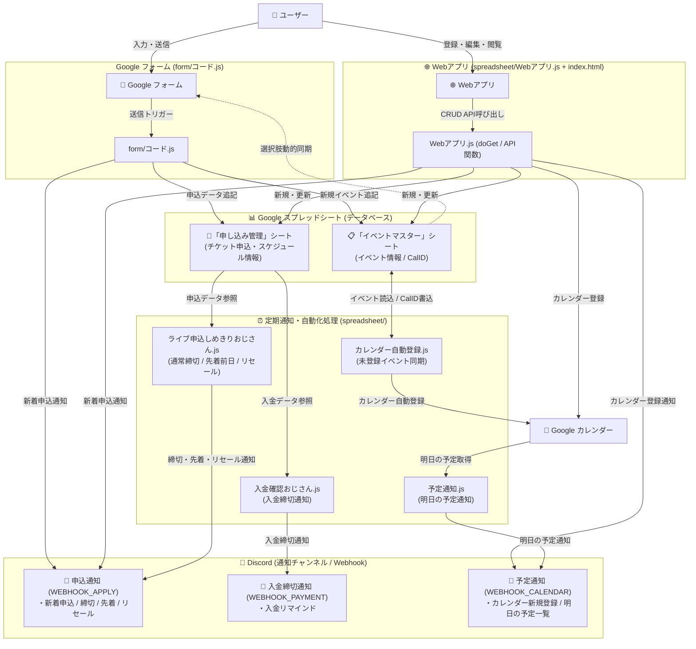

# システム構造 & フォーム・スプレッドシート仕様書

本ドキュメントは `discord-notifier` システムにおける Google フォームの構成、Google スプレッドシートのテーブル定義（列インデックス）、自動計算数式、およびデータ連携フローに関する仕様書です。

---

## 1. システム概要・データフロー

本システムは **Google フォーム** または **Webアプリ** からのイベント・申込登録を起点とし、**Google スプレッドシート** をデータベースとしてイベントマスター・申し込み管理を統合管理します。



---

## 2. Google フォーム設計仕様

Google フォームは 3 つのセクション（ページ分割）で構成され、選択肢に応じて動的にページ遷移します。


### セクション構成と設問項目

#### ■ セクション 1: イベント選択
| 設問タイトル | フォーム要素 | 必須 | 概要・挙動 |
| :--- | :--- | :--- | :--- |
| **イベント名** | ドロップダウン / ラジオボタン | 必須 | スプレッドシートの「イベントマスター」から自動同期された選択肢。<br>・既存イベント選択時 ➔ **セクション 3 へ移動**<br>・`【新規登録】新しいイベントを入力する` 選択時 ➔ **セクション 2 へ移動** |

#### ■ セクション 2: 新規イベント情報
> ※「イベント名」で `【新規登録】新しいイベントを入力する` を選択した場合のみ表示

| 設問タイトル | フォーム要素 | 必須 | 概要・データ形式 |
| :--- | :--- | :--- | :--- |
| **新規イベント名（新しいイベントの場合のみ入力）** | 記述式 (ショート) | 必須 | イベントの正式名称 |
| **ブランド** | 記述式 / ドロップダウン | 任意 | 例: `学マス`, `デレ`, `シャニ` 等 |
| **開始日** | 日付 | 必須 | `yyyy-MM-dd` |
| **終了日** | 日付 | 任意 | `yyyy-MM-dd` (無ければ開始日と同日) |
| **会場** | 記述式 (ショート) | 任意 | イベント開催場所 |
| **イベント概要** | 段落 (ロング) | 任意 | メモ・補足説明 |

#### ■ セクション 3: 申し込み情報 (共通)
> 既存イベント選択、または新規イベント入力後に進むセクション

| 設問タイトル | フォーム要素 | 必須 | 概要・データ形式 |
| :--- | :--- | :--- | :--- |
| **受付名（先行/一般など）** | 記述式 (ショート) | 必須 | 受付区分 (例: `アソビストア限定先行`, `一般先着`, `公式リセール`) |
| **申込方法** | 記述式 / 段落 | 任意 | チケット申込方法（URLまたは応募手順等の複数行テキスト） |
| **申込開始日** | 日時 | 任意 | `yyyy-MM-dd HH:mm` |
| **申込締切日** | 日時 | 必須 | `yyyy-MM-dd HH:mm` |
| **当落発表日** | 日時 | 任意 | `yyyy-MM-dd HH:mm` |
| **入金締め切り日** | 日時 | 任意 | `yyyy-MM-dd HH:mm` |

---

## 3. Google スプレッドシート構造仕様

本システムが参照・書き込みを行うスプレッドシートの全シート構造です。

---

### 3.1 「イベントマスター」シート

イベントの基本情報を管理するマスターテーブルです。

| 列 | 列名 | 定数名 (`MASTER_COL`) | データ型 | 説明・自動計算ルール |
| :---: | :--- | :--- | :--- | :--- |
| **A** | イベントID | `ID` (0) | 文字列 | `EV-001`, `EV-002` ... の形式で自動採番 |
| **B** | ブランド名 | `BRAND` (1) | 文字列 | ブランド表記 (例: `学マス`) |
| **C** | イベント名 | `EVENT_NAME` (2) | 文字列 | イベントの正式名称 |
| **D** | 開始日 | `START_DATE` (3) | 日付 | 開催開始日 (`yyyy-MM-dd`) |
| **E** | 終了日 | `END_DATE` (4) | 日付 | 開催終了日 (`yyyy-MM-dd`) |
| **F** | 会場 | `LOCATION` (5) | 文字列 | 開催場所 |
| **G** | イベント概要 | `SUMMARY` (6) | 文字列 | 補足説明 |
| **H** | カレンダー登録ID | `CAL_ID` (7) | 文字列 | Google カレンダー同期時の Event ID |
| **I** | ステータス | - (8) | 数式 | 自動計算ステータス (`開催前` / `開催期間` / `開催終了`) |

#### I列の自動計算数式 (`masterIfsFormula`)
```excel
=IFS(
  ISBLANK(D2), "未設定",
  TODAY() < INT(D2), "開催前",
  TODAY() <= INT(IF(ISBLANK(E2), D2, E2)), "開催期間",
  TRUE, "開催終了"
)
```

---

### 3.2 「申し込み管理」シート

各チケットの申し込み・抽選・入金スケジュールを管理するテーブルです。

| 列 | 列名 | 定数名 (`APPLY_COL`) | データ型 | 説明・自動計算ルール |
| :---: | :--- | :--- | :--- | :--- |
| **A** | 申し込みID | `APPLY_ID` (0) | 文字列 | `AP-001`, `AP-002` ... の形式で自動採番 |
| **B** | イベントID | `EVENT_ID` (1) | 文字列 | 「イベントマスター」と結合する `EV-xxx` |
| **C** | ブランド | - (2) | 文字列 | ブランド表記 |
| **D** | イベント名 | `EVENT_NAME_ALT` (3) | 文字列 | イベント名表記 |
| **E** | 受付名/申し込み名称 | `APPLY_NAME` (4) | 文字列 | 受付区分 (例: `一般先行`, `一般先着`, `公式リセール`) |
| **F** | 申込開始日時 | - (5) | 日時 | `yyyy-MM-dd HH:mm` |
| **G** | 申込締切日時 | `APPLY_END_DATE` (6) | 日時 | `yyyy-MM-dd HH:mm` |
| **H** | 申込方法 | `APPLY_METHOD` / `URL` (7) | 文字列 | チケット申込方法（URLまたは応募手順などのテキスト） |
| **I** | 当落発表日時 | - (8) | 日時 | `yyyy-MM-dd HH:mm` |
| **J** | 入金締切日時 | `PAY_END_DATE` (9) | 日時 | `yyyy-MM-dd HH:mm` |
| **K** | ステータス | `STATUS` (10) | 数式 | 自動計算ステータス (下記参照) |

#### K列の自動計算数式 (`ifsFormula`)
```excel
=IFS(
  AND(NOT(ISBLANK(F2)), NOW() < F2), "開始前",
  AND(NOT(ISBLANK(G2)), NOW() <= G2), "受付期間",
  AND(NOT(ISBLANK(I2)), NOW() < I2), "抽選終了・当落確認前",
  AND(NOT(ISBLANK(J2)), NOW() <= J2), "当落確認・入金期間",
  TRUE, "期間終了"
)
```

---

## 4. Webアプリ仕様 (`spreadsheet/Webアプリ.js` + `index.html`)

Google Apps Script の Webアプリ機能（HTML Service）を用いたカンバン風ビューワー兼管理アプリです。

### 4.1 アクセス・デプロイ

| 項目 | 詳細 |
| :--- | :--- |
| **エントリーポイント** | `doGet(e)` — GAS Webアプリとして公開 |
| **フロントエンド** | `spreadsheet/index.html`（SPA / Glassmorphism UI） |
| **URL短縮** | Cloudflare 等のプロキシで短縮した URL を `WEBAPP_URL` に設定 |
| **スマホ対応** | モバイルファースト・縦画面最適化（bottom navigation, ステータスタブ） |

### 4.2 提供機能

| 機能 | 説明 |
| :--- | :--- |
| **イベント一覧（カード表示）** | ブランド・ステータス（開催前/開催期間/開催終了）でフィルタリング可能 |
| **申込カンバンボード** | ステータス列（開始前/受付期間/当落待ち/入金期間/期間終了）にカード表示 |
| **タイムラインビュー** | 締切日時順の一覧表示。スマホ時はステータスタブで絞り込み可能 |
| **イベント新規登録** | フォームUIから登録 → スプレッドシート追記 + カレンダー自動追加 + Discord通知 |
| **申込新規登録** | フォームUIから登録 → スプレッドシート追記 + Discord通知（開催終了イベントは選択肢から除外） |
| **イベント編集** | カードから編集モーダルを開き情報を更新（ステータスは数式のため編集不可） |
| **申込編集** | カードから編集モーダルを開き情報を更新 |
| **ブランドフィルター** | ブランドチップで全ビュー横断フィルタリング |

### 4.3 GAS API 関数一覧

| 関数名 | 処理概要 |
| :--- | :--- |
| `doGet(e)` | HTML テンプレートを返す。初期データをサーバー側で注入し表示を高速化 |
| `getAppData()` | イベント・申込・ブランド一覧を取得して返す |
| `createEvent(data)` | イベントを新規登録。Google カレンダー追加 & Discord（`WEBHOOK_CALENDAR`）通知 |
| `updateEvent(data)` | イベント情報を更新。申し込み管理シートのブランド・イベント名も同期 |
| `createApplication(data)` | 申込を新規登録。Discord（`WEBHOOK_APPLY`）通知 |
| `updateApplication(data)` | 申込情報を更新（ステータス数式は維持） |

---

## 5. 共通設定・定数 (`spreadsheet/共通関数.js`)

### 5.1 環境変数（スクリプトプロパティ / `config.local.js`）

| 定数名 | 説明 |
| :--- | :--- |
| `COMMON_SHEET_URL` | 管理用スプレッドシートの URL |
| `CALENDAR_ID` | Google カレンダーの ID |
| `PROXY_BASE_URL` | Discord Webhook 送信用プロキシのベース URL |
| `WEBHOOK_APPLY` | 申込通知用 Discord Webhook URL |
| `WEBHOOK_PAYMENT` | 入金締切通知用 Discord Webhook URL |
| `WEBHOOK_CALENDAR` | カレンダー予定・イベント登録通知用 Discord Webhook URL |
| `WEBAPP_URL` | Webアプリの公開 URL（Cloudflare 等で短縮したもの） |

> **ローカル環境**: `config.local.js` で定義（`.gitignore` 対象）
> **本番環境 (GAS)**: `PropertiesService.getScriptProperties()` から取得

### 5.2 定数オブジェクト

| 定数名 | 説明 |
| :--- | :--- |
| `MASTER_COL` | 「イベントマスター」シートの列インデックス（0始まり） |
| `APPLY_COL` | 「申し込み管理」シートの列インデックス（0始まり） |
| `REGISTRATION_FORM_URL` | イベント・申込の Google フォーム URL（ハードコード） |

---

## 6. Discord 通知仕様

### 6.1 通知チャンネル別の送信ルール

| Webhook | 送信タイミング | フッター |
| :--- | :--- | :--- |
| `WEBHOOK_APPLY` | フォーム送信時・Webアプリ登録時（新着申込）<br>毎日の申込締切リマインド（通常 / 先着前日 / リセール） | 新着登録時：**フッターなし**<br>締切リマインド時：登録フォームURL + WebアプリURL |
| `WEBHOOK_PAYMENT` | 毎日の入金締切リマインド | 登録フォームURL + WebアプリURL |
| `WEBHOOK_CALENDAR` | Webアプリからのイベント新規登録時<br>毎日の明日の予定通知 | 新規登録時：**フッターなし**<br>予定通知時：フッターなし |

### 6.2 主要な通知フォーマット

#### 新着申込通知（フォーム経由・Webアプリ経由 共通）
```
🆕 **新しいチケット申込が登録されたよ！**

📅 **【ブランド】イベント名**
 └ 受付区分: 受付名
 └ 申込締切: **yyyy-MM-dd HH:mmまで**
 └ 入金締切: **yyyy-MM-dd HH:mmまで**（入金締切がある場合）
 └ 申込方法: URL または手順テキスト
```

#### Googleカレンダー新規登録通知
```
🆕 **Googleカレンダーに新しいイベントを登録したよ！**

📅 **【ブランド】イベント名**
 └ 期間: **MM/dd 〜 MM/dd [終日]**
 └ 会場: 会場名（あれば）
 └ 概要: テキスト（あれば）
```

#### 申込締切リマインド
```
🔔 **本日締切のチケット申込があります！**

📅 **【ブランド】イベント名**
 └ 受付区分: 受付名
 └ 締切時刻: **HH:mmまで**
 └ 申込方法: URL または手順テキスト

----------------------------------------
📝 **イベント・申込の確認＆登録はこちら**
・【フォーム (登録)】: https://forms.gle/...
・【Webアプリ (一覧・カンバン)】: https://your-webapp-url
```

---

## 7. 自動化機能 & トリガー定義

システム内で稼働する自動化機能の一覧です。

| 実行スクリプト | 関数名 | トリガー種別 | 実行頻度 / イベント | 処理概要 |
| :--- | :--- | :--- | :--- | :--- |
| **`form/コード.js`** | `onFormSubmit` | **フォーム** | **フォーム送信時** | 1. フォームの回答からイベント/申込行を追記<br>2. ID自動採番 & IFS数式を挿入<br>3. フォーム選択肢を更新<br>4. Discord（`WEBHOOK_APPLY`）に新着申込を通知 |
| **`form/コード.js`** | `updateFormOptions` | 関数呼出 | フォーム送信時 | 終了日が今日以降のイベントを取得し、フォームの選択肢（ドロップダウン）を動的に再構築 |
| **`spreadsheet/Webアプリ.js`** | `doGet` / 各API | **Webアプリ** | **HTTPリクエスト時** | イベント・申込の閲覧・新規登録・更新。カレンダー同期とDiscord通知も実行 |
| **`spreadsheet/ライブ申込しめきりおじさん.js`** | `remindEndDate` | 時間主導型 | 毎日 (午前) | 1. 本日申込締切の通常チケットを Discord へ通知<br>2. 翌日開始の**先着受付**がある場合は2通目として別途通知<br>3. 受付期間中の**リセール**がある場合は3通目として別途通知 |
| **`spreadsheet/入金確認おじさん.js`** | `remindPaymentEndDate` | 時間主導型 | 毎日 (午前) | 本日入金締切のチケットを抽出して Discord へ一覧通知 |
| **`spreadsheet/予定通知.js`** | `notifyTomorrowEvents` | 時間主導型 | 毎日 (夕方〜夜) | 明日開催予定のイベントを Google カレンダーから取得し Discord へ通知 |
| **`spreadsheet/カレンダー自動登録.js`** | `registerEventsToCalendar` | 時間主導型 | 定期 (1時間毎推奨) | スプレッドシート上の未登録イベントを Google カレンダーに自動登録し、H列に CalID を書き戻す |
